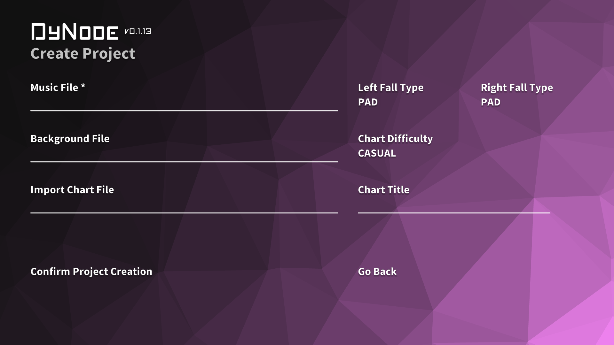

# Project

This page explains the concept of a project in DyNode.

## What a Project Contains

A DyNode project contains all the information needed to make a chart, such as difficulty, title, music, background files, timing, and specific chart content.

The project is stored in plain text in JSON format, with the file extension .dyn.

:::tip
This file does not include the actual content of the music and background files, but only their **relative paths** on the computer.

Music, background, and video files associated with the chart will be copied to the same directory as the project when it is saved. If these files are deleted or moved, the associated music, background, and video may not load correctly, but this will not affect your chart content. You only need to manually reload the music and background files and save them again.
:::

## Creating a New Project
Click "Create New Project" on the start screen or use <kbd>Ctrl+N</kbd> in the chart editing interface to create a new project.

Fill in all the information of the project in turn, where the asterisk indicates a required field.

* **Music File\*** : **Required. Select the music file for charting.** Supports most mainstream file formats (.mp3/.wav/.ogg/.flac, etc.), see [Timing](timing.html#mp3-and-wav-format-delay-handling) for details on delay issues with .mp3 and .wav.
  * If you choose to import a chart from a .dy file, you do not need to fill in this field.
* Background File: Choose a background file. Supports mainstream image formats (.jpg/.jpeg/.png), defaults to a plain white background if not selected.
* Fall Type: Choose the fall type for the left and right sides.
  - MULTI: Can place three types of notes: Note, Hold, and Chain.
  - PAD: Can place two types of notes: Note and Hold.
  - MIXER: Can place Chain-type notes, with a slider.
* Chart Difficulty: Choose the difficulty of the chart.
* Chart Title: Enter the title of the chart.
* Import Chart File: If you want to import a .xml/.dy chart file, you can directly select the chart file here. If you choose to import a chart file, you do not need to fill in information such as Fall Type/Difficulty/Title.

After filling in all the information, you can enter the editing interface.

:::tip
Before you start editing the chart, you should correctly configure [Timing](timing.html).
:::

## Opening a Project

Choose "Open an Existing Project" on the start screen or use <kbd>F1</kbd> in the chart editing interface to open an existing project.

## Saving a Project

Use <kbd>Ctrl+S</kbd> to save the project.

Use <kbd>F8</kbd> to enable the auto-save feature. Auto-save will automatically save the chart every 5 minutes (at least one manual save is required to enable auto-save), and it is turned off by default.
