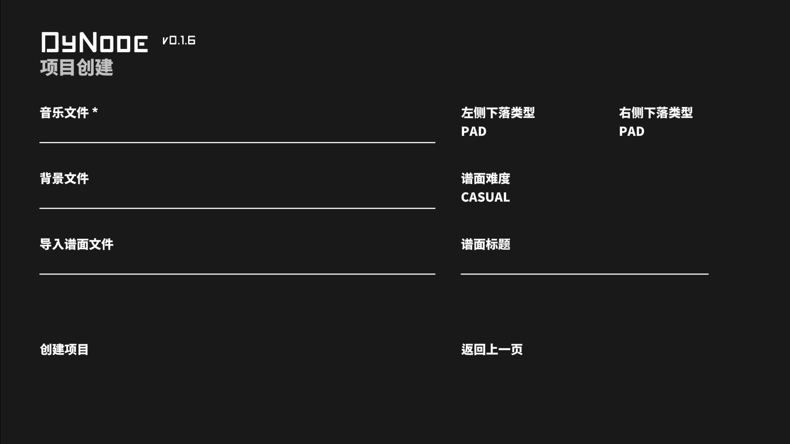

# 项目

本页面讲解 DyNode 有关项目的概念。

## 项目所包含的

DyNode 的项目包含制作谱面所需的全部信息。如难度、标题、音乐、背景文件、校时与具体的谱面内容等。

项目将被以 JSON 格式的纯文本方式存储在后缀为 .dyn 的文件当中。

:::tip
这个文件不包含音乐与背景的文件内容，而只包含它们在计算机中存储的**相对路径**。

与谱面关联的音乐、背景与视频文件将在项目被保存的时候复制到项目所处的同级目录下。当这些文件被删除或移动时，相关联的音乐、背景与视频可能无法正常加载，但这不会影响你的谱面内容。你只需要手动重新加载音乐与背景文件并保存即可。
:::

## 新建项目
在开始界面点击“新建项目”或在谱面编辑界面使用 <kbd>Ctrl+N</kbd> 来新建项目。

依次填写项目的所有信息即可，其中星号代表此为必填项目。

* **音乐文件\*** : **必填项目，选择制谱的音乐文件。** 支持大部分主流文件格式（.mp3/.wav/.ogg/.flac等），关于 .mp3 与 .wav 的延迟问题详见 [校时](/guide/timing.html#mp3-与-wav-格式的延迟处理) 。
  * 如果你选择从 .dy 文件导入谱面，则无需填写该项。
* 背景文件：选择背景文件。支持主流的图片格式（.jpg/.jpeg/.png），若不选默认为白色纯色背景。
* 下落类型：选择左侧与右侧的下落类型。
  - MULTI: 可以放置 Note, Hold 与 Chain 三种类型的音符
  - PAD: 可以放置 Note 与 Hold 两种类型的音符。
  - MIXER: 可以放置 Chain 类型的音符，带有滑板。
* 谱面难度：选择谱面的难度。
* 谱面标题：输入谱面的标题。
* 导入谱面文件：如果你想导入 .xml/.dy 谱面文件，则你可以直接在此处选择该谱面文件。如果你选择导入谱面文件，则你无需填写 下落类型/谱面难度/谱面标题 等信息。

填写完所有信息后，即可进入编辑界面。

:::tip
在开始编辑谱面之前，你应当正确配置 [校时](/guide/timing.html) 。
:::

## 打开项目

在开始界面选择“打开已有的项目”或在谱面编辑界面中使用 <kbd>F1</kbd> 来打开已有的项目。

## 保存项目

使用 <kbd>Ctrl+S</kbd> 来保存项目。

使用 <kbd>F8</kbd> 来启用自动保存功能，详见 [铺面编辑/自动保存项目](/guide/edit.md#自动保存项目)。

## 另存为项目

使用 <kbd>Ctrl+Shift+S</kbd> 来使用另存为项目。